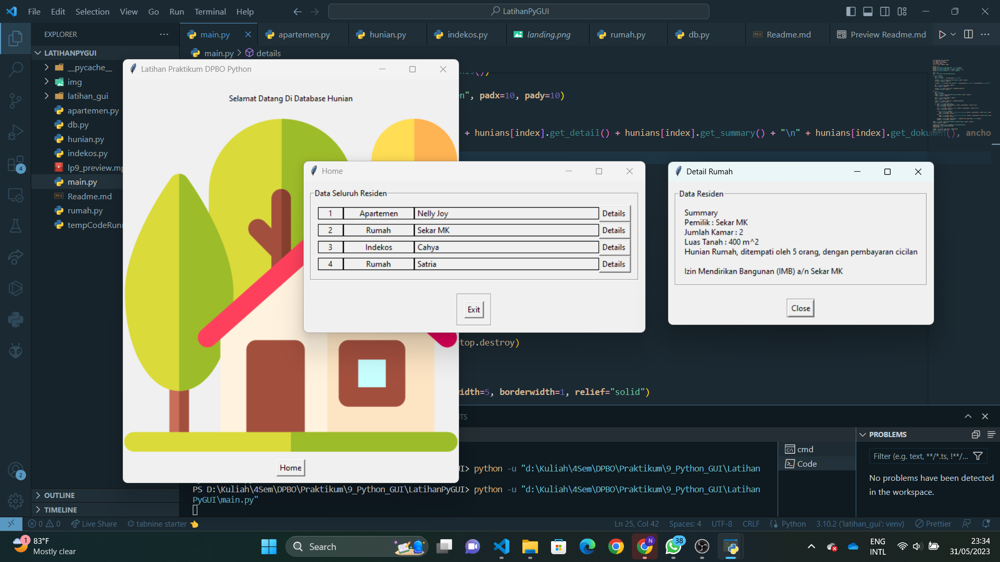

# LP9DPBO2023C1
Latihan Praktikum 9 Mata Kuliah Desain dan Pemrograman Berorientasi Objek. Program Python GUI menampilkan data.

Saya Najma Qalbi Dwiharani dengan NIM 2102843 mengerjakan soal LP 9 dalam mata kuliah Desain dan Pemrograman Berorientasi Objek untuk keberkahanNya maka saya tidak melakukan kecurangan seperti yang telah dispesifikasikan. Aamiin.

## Penambahan Atribut dan Method

### Class Hunian

- atribut pembayaran
- method get dari pembayaran

### Class Apartemen

- atribut lantai
- method get dari lantai

### Class Rumah

- atribut luas tanah
- method get dari luas tanah

### Class Indekos

- atribut is kamar kosong (ada kamar kosong pada indekos yang sama atau tidak), dengan asumsi pemilik indekos adalah pemilik satu kamar
- method get dari is kamar kosong

## Alur Program

Program ini dimulai dengan landing page, kemudian ke home untuk melihat data residen, dan akan muncul window baru jika tombol detail pada tabel data residen di-klik.

## Dokumentasi

  